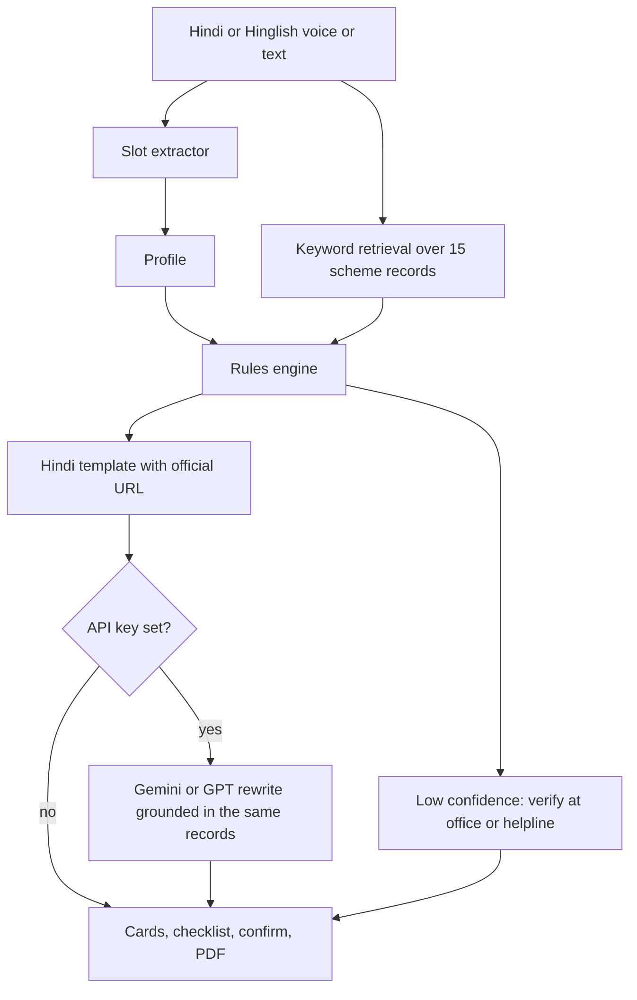

# सरकारी साथी · Sarkari Saathi

A Hindi-first voice and text assistant that explains Indian government schemes in plain Hindi. Built for the AI Build Challenge 2026, track PS-06 (AI for Bharat in Indian Languages).

A small farmer, a daily-wage worker, or an older person who is comfortable in Hindi can ask which scheme fits, hear the answer, see the papers to carry, and leave with a form draft they have checked themselves. The app does not file anything.

## Features

1. **Hindi voice in and out.** Type, or use the mic. Speech recognition and readout use the browser Web Speech API in `hi-IN`. Hinglish works on the text path (`mujhe kisaan ke liye kaunsi yojana milegi?`).
2. **Scheme finder.** Age, state, occupation, income, land, category, and gender, plus a few yes/no facts, go through a rules engine.
3. **Cited answers.** Every scheme card and every scheme named in the answer carries the official URL and the date that page was checked (27 September 2026).
4. **Document checklist.** Papers for each matched scheme, from the same record as the answer.
5. **Guided form draft.** A PDF is built in the browser. The download stays off until the person confirms they have reviewed it. The file says it is a draft and that it was not submitted.

Fifteen central schemes are in the knowledge base: PM-KISAN, Ayushman Bharat PM-JAY, PMAY-G, PM Ujjwala, Sukanya Samriddhi, Atal Pension Yojana, PMJJBY, PMSBY, PM Mudra, PM Vishwakarma, National Scholarship Portal, e-Shram, PM SVANidhi, Janani Suraksha Yojana, and the NSAP old-age pension (IGNOAPS).

## What works with no key, and what a key adds

| | No key (the deployed demo) | `GEMINI_API_KEY` or `OPENAI_API_KEY` |
| --- | --- | --- |
| Eligibility | Rules engine | Same rules engine. The model is not allowed to change the status. |
| Wording | Fixed simple Hindi | The model rewrites the prose from the retrieved records only. |
| Citations | Always, from the record | Appended again if the model drops a URL. |
| Voice | Browser `hi-IN` | Same. No Sarvam, Bhashini, or Whisper call in this build. |
| PDF | Browser, after confirmation | Same. |

If the model request fails, the Hindi template is what the person sees.

## Architecture



Details, sources, and the plan through 1 October are in [docs/PLAN.md](docs/PLAN.md). Models, APIs, and datasets are listed in [docs/AI_DISCLOSURE.md](docs/AI_DISCLOSURE.md).

## Local setup

Node.js 20 or newer.

```bash
npm install
cp .env.example .env.local   # leave the keys empty
npm run dev
```

Open http://localhost:3000.

```bash
npm test          # unit tests for rules, citations, and the confirm gate
npm run eval      # 58 Hindi and Hinglish queries
npm run build && npm start
```

### Environment

See `.env.example`.

- `GEMINI_API_KEY`, `GEMINI_MODEL` (default `gemini-2.0-flash`)
- `OPENAI_API_KEY`, `OPENAI_MODEL` (default `gpt-4o-mini`), used only when Gemini is unset

No database and no other secret. Vercel can import this repository with zero extra config: it is a Next.js App Router project.

## Evaluation

`eval/cases.ts` has **58** questions (**34** Hindi, **24** Hinglish) and **6** persona profiles. A case passes when every expected scheme is `eligible` or `likely`, and every forbidden scheme is not. Citation passes when the official URL of each expected scheme is in the answer (or any official URL, when the correct outcome is a confident rejection). Low-confidence agreement checks the flag on out-of-scope questions, list-based `likely` matches, and confident eligibility decisions.

Latest run (`npm run eval`, 27 September 2026), also stored in `eval/results.json`:

| Metric | Result |
| --- | --- |
| Eligibility accuracy | **100%** (58/58) |
| Citation presence | **100%** (53/53 cases that require a source) |
| Low-confidence agreement | **100%** (58/58) |
| Unit tests | 10 passing |

This is a deterministic check against labels written from the same official rules as the engine, including negatives (income-tax payer, wrong age, man asking for Ujjwala, pucca house, out-of-scope cricket and weather). It is not a blind field study. Hindi fluency still needs a human rating of 1–5 before submission. The deck's target was at least 90% eligibility accuracy and a cited answer.

## Demo script (about 3 minutes)

1. **0:00** Open the deployed link on a phone. Point at the banner: nothing is submitted, and a weak answer says to check the office.
2. **0:20** Tap the mic, or type: `mujhe kisaan ke liye kaunsi yojana milegi? main UP ka kisaan hoon, umar 42, 2 acre, bank account hai`. Show PM-KISAN in Hindi, ₹6,000, and the pmkisan.gov.in link. Tap “ज़ोर से सुनें”.
3. **1:05** Open पात्रता. Fill a 68-year-old BPL person in Bihar and press योजनाएँ देखें. Show the old-age pension and the note that the state adds its own top-up.
4. **1:40** Ask `aaj cricket ka score kya hai`. Show the low-confidence line and that no scheme is recommended.
5. **2:00** Open दस्तावेज़ on the farmer result, then ड्राफ्ट. Leave the confirm box empty and show that download stays disabled. Check the box, download the PDF, and show the “not submitted” line.
6. **2:40** Tap one official link so the source opens. Close on the badge “बिना कुंजी · स्थानीय”.

## Status against 1 October

In this repository now: keyless Hindi MVP, 15 sourced schemes, voice buttons, checklist, confirmed PDF, tests, eval, and a Vercel-ready Next.js app.

Still to do before the deadline: record the 3-minute video, export the 10-slide project deck, and optionally re-score the 58 answers with a Gemini key plus a human Hindi rating. State schemes and Sarvam or Bhashini speech are upgrades, not required for the keyless demo.
